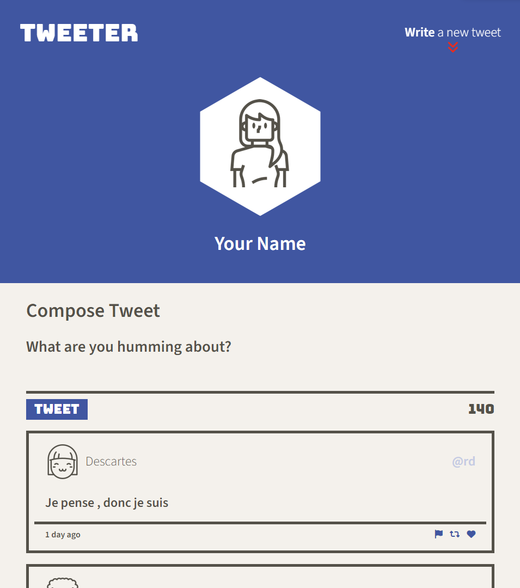

# Tweeter Project

Tweeter is a simple, single-page Twitter clone now known as X that allows you to post tweets to the main page.

## Final Product

### Main page

### Errors

## Getting Started

1. [Create](https://docs.github.com/en/repositories/creating-and-managing-repositories/creating-a-repository-from-a-template) a new repository using this repository as a template.
2. Clone your repository onto your local device.
3. Install dependencies using the `npm install` command.
3. Start the web server using the `npm run local` command. The app will be served at <http://localhost:8080/>.
4. Go to <http://localhost:8080/> in your browser.

## Dependencies

- Express
- Node 5.10.x or above
